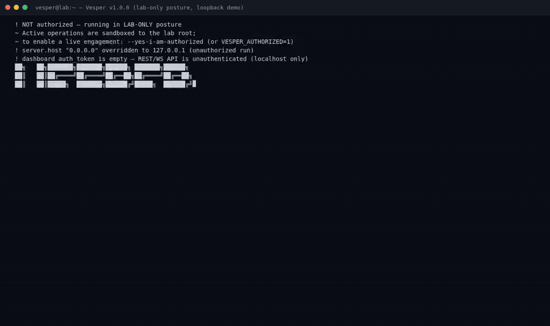
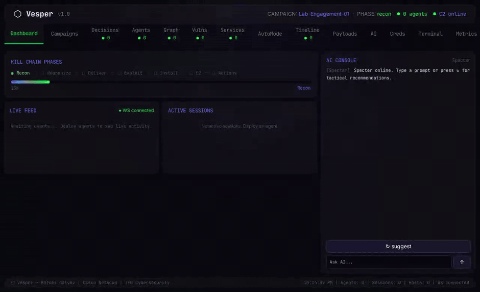

# Vesper

**Plataforma semi-autónoma de operaciones red team** — núcleo Go, puente Python, dashboard Vue 3.

> Antes llamado `X404X`. Remodelado en 2026: un solo módulo Go, documentación honesta y controles de seguridad reales.

[](https://github.com/Ruby570bocadito/Vesper/actions/workflows/ci.yml)


**Read this in English:** [README.md](README.md)

---

## ¿Qué es Vesper?

Vesper es una plataforma educativa de operaciones red team que modela cómo
funciona un engagement real de principio a fin: orquestación de campañas,
arquitectura C2/agente, un puente post-explotación con ~40 handlers, una
consola de operador (estilo msfconsole) y un dashboard Vue 3 en tiempo real
con streaming de eventos por WebSocket.

Está diseñado para ser **seguro por defecto** y **honesto por diseño**: toda
operación que toca ficheros está aislada en un directorio de laboratorio, los
caminos destructivos exigen autorización explícita, y este README documenta lo
que el código hace de verdad — no lo que un changelog soñó en su día.

## Vélo en acción

*GIFs: `docs/images/demo-cli.gif` (consola de operador) y `docs/images/demo-dashboard.gif` (dashboard Vue 3)*





## Características (verificadas)

- **Un único módulo Go** (`go build ./...` funciona; ambos binarios compilan en CI)
- **Consola de operador**: REPL estilo msfconsole — campañas, agentes,
  credenciales, visualización de kill chain, kill switch (`kill_switch EMERGENCY_STOP`)
- **API REST + WebSocket**: auth JWT (`internal/api`), 25+ rutas, hub de
  eventos en tiempo real, sirve el dashboard compilado
- **Núcleo de agente**: gestor de módulos, cliente de bridge (TCP JSON-RPC + gRPC),
  bucle de auto-reparación, fases de kill chain (`internal/agent`)
- **Orquestador**: FSM de campaña, decisiones con aprobación del operador,
  grafo mundial (`internal/orchestrator`)
- **Criptografía post-cuántica**: Kyber-1024 KEM, X25519, Ed25519, XChaCha20-Poly1305
  (`internal/crypto`, testeada)
- **Estado**: SQLite vía modernc (sin CGO) con FSM y persistencia (`internal/appstate`)
- **Puente Python**: ~40 handlers vivos (recon, privesc, AD, volcado de
  credenciales, escáner web, grafos de ataque) con **sandbox de laboratorio**
- **Dashboard Vue 3**: Vite 6, Pinia, terminal xterm.js, grafo de fuerza D3

## Modelo de seguridad (real, no decorativo)

| Control | Dónde | Por defecto |
|---|---|---|
| Postura solo-laboratorio | `cmd/vesper/safety.go` + `modules/bridge/safety.py` | **ACTIVA** |
| Puerta de autorización | `--yes-i-am-authorized` / `VESPER_AUTHORIZED=1` | obligatoria para uso live |
| Sandbox de ficheros | todas las E/S del bridge dentro de `VESPER_LAB_ROOT` | `./lab_root` |
| Protección de bind | runs sin autorizar fuerzan `127.0.0.1` | ACTIVA |
| Kill switch | `VESPER_KILLSWITCH=1` o `kill_switch <código>` en consola | `EMERGENCY_STOP` |
| Aviso de auth del dashboard | advertencia al arrancar si `auth_token` vacío | ACTIVA |

Los antiguos defaults `Simulation:false` y los handlers "de simulación" que
escribían en ficheros reales fueron eliminados en la remodelación.
Ver [SECURITY.md](SECURITY.md).

## Inicio rápido

```bash
git clone https://github.com/Ruby570bocadito/Vesper.git
cd Vesper
make setup          # go mod download + pytest + deps web

make build          # dist/vesper (CLI) + dist/implant (beacon)
./dist/vesper       # consola interactiva

make test           # tests Go + puente Python
make lab-up         # laboratorio Docker (atacante + objetivos vulnerables)
```

Requisitos: Go 1.26+, Python 3.11+, Node 22 (dashboard), Docker (lab, opcional).

## Arquitectura

```
  Operador                 Navegador (dashboard Vue 3)
     │                            │ REST + WS
     ▼                            ▼
┌─────────────────────────────────────────┐
│                 vesper CLI              │
│  consola · orquestador · servidor API   │
│  appstate (SQLite) · c2server (gRPC)    │
└───────────────┬─────────────────────────┘
                │ cliente bridge (TCP JSON-RPC / gRPC)
                ▼
┌─────────────────────────────────────────┐
│           Puente Python (~40 handlers)  │
│  recon · privesc · AD · credenciales    │
│  sandbox: VESPER_LAB_ROOT               │
└─────────────────────────────────────────┘
```

## Estructura del proyecto

```
cmd/vesper/          CLI + consola + lanzador del dashboard + puerta de seguridad
cmd/implant/         beacon C2 mínimo (artefacto de laboratorio)
internal/            api · agent · orchestrator · appstate · c2server
                     crypto · defense · dispatch · registry · plugins
pkg/proto/           fuentes .proto + código gRPC generado
pkg/shared/          config · logger · types
modules/bridge/      puente IPC Python + handlers + sandbox de seguridad
plugins/ai/          plugins de IA (hivemind federated, vishing, autofactory)
plugins/rf_contagion plugin de estudio de propagación RF
web/                 dashboard Vue 3 (Vite + Pinia + xterm + D3)
lab/                 laboratorio Docker (atacante, objetivos, AD, escenarios EDR)
test/                scripts de ejecución (go, python, e2e)
docs/                documentación — este archivo es la entrada en español
```

## Documentación

| Documento | Descripción |
|-----------|-------------|
| [README.md](README.md) | English readme |
| [docs/USAGE.md](docs/USAGE.md) | Flujos de operador (consola, API, dashboard) |
| [docs/COMMANDS.md](docs/COMMANDS.md) | Referencia de comandos de consola |
| [docs/API_REFERENCE.md](docs/API_REFERENCE.md) | Endpoints REST + WebSocket |
| [docs/DEPLOYMENT.md](docs/DEPLOYMENT.md) | Despliegue y laboratorio |
| [docs/TESTING_GUIDE.md](docs/TESTING_GUIDE.md) | Cómo funcionan las suites de test |
| [CHANGELOG.md](CHANGELOG.md) | Historial de versiones (honesto, cronológico) |
| [SECURITY.md](SECURITY.md) | Modelo de seguridad y uso responsable |

## Estado de los tests

- Go: 7 paquetes con tests — todos en verde (`go test ./...`)
- Puente Python: 15 tests incluido el contrato del sandbox — todos en verde
- El CI compila **ambos binarios**, ejecuta todos los tests y falla si algún
  test muta un fichero del repositorio (la regresión que mató al repo antiguo
  ahora es imposible de fusionar)

## Licencia

MIT © 2026 Rafael Gálvez. Ver [LICENSE](LICENSE).

> **Aviso**: proyecto educativo para investigación de seguridad autorizada y
> engagements autorizados en entornos de laboratorio aislados. Ejecutar esto
> contra sistemas que no posees o sin permiso escrito es ilegal. La postura
> por defecto es solo-laboratorio; los autores no se responsabilizan del mal uso.
