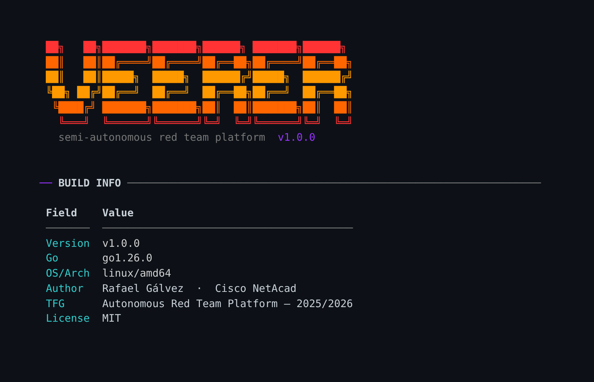

# Vesper



**Semi-autonomous red team operations platform** — Go core, Python bridge, Vue 3 dashboard.

>formerly `X404X`. Remodelled in 2026: single Go module, honest docs, real safety controls.

[](https://github.com/Ruby570bocadito/Vesper/actions/workflows/ci.yml)


**Read this in Spanish:** [README.es.md](README.es.md)

---

## What is Vesper?

Vesper is an educational red-team operations platform that models how a real
engagement works end-to-end: campaign orchestration, a C2/agent architecture,
a post-exploitation bridge with ~40 handlers, an operator console (msf-style),
and a real-time Vue 3 dashboard with WebSocket event streaming.

It is designed to be **safe by default** and **honest by design**: every
file-touching operation is sandboxed to a lab directory, destructive paths
require explicit authorization, and this README documents what the code
actually does — not what a changelog once dreamed.

## See it in action

*GIFs: `docs/images/demo-cli.gif` (operator console) and `docs/images/demo-dashboard.gif` (Vue 3 dashboard)*


## Features (verified)

- **Single Go module** (`go build ./...` works; both binaries compile in CI)
- **Operator console**: msfconsole-style REPL — campaigns, agents, credentials,
  kill chain visualisation, kill switch (`kill_switch EMERGENCY_STOP`)
- **REST API + WebSocket**: JWT auth (`internal/api`), 25+ routes, real-time
  event hub, serves the built dashboard
- **Agent core**: module manager, bridge client (TCP JSON-RPC + gRPC),
  self-healing loop, kill-chain phases (`internal/agent`)
- **Orchestrator**: campaign FSM, decision records with operator approval,
  world graph (`internal/orchestrator`)
- **Post-quantum crypto**: Kyber-1024 KEM, X25519, Ed25519, XChaCha20-Poly1305
  (`internal/crypto`, unit-tested)
- **State**: SQLite via modernc (CGO-free) with FSM + persistence (`internal/appstate`)
- **Python bridge**: ~40 live handlers (recon, privesc, AD collection, credential
  dump, web scanning, attack-path graphs) with a **lab sandbox**
- **Vue 3 dashboard**: Vite 6, Pinia, xterm.js terminal, D3 force graph — builds in seconds

## Safety model (real, not decorative)

| Control | Where | Default |
|---|---|---|
| Lab-only posture | `cmd/vesper/safety.go` + `modules/bridge/safety.py` | **ON** |
| Authorization gate | `--yes-i-am-authorized` / `VESPER_AUTHORIZED=1` | required for live use |
| File sandbox | all bridge file ops resolve inside `VESPER_LAB_ROOT` | `./lab_root` |
| Bind protection | unauthorized runs force `127.0.0.1` | ON |
| Kill switch | `VESPER_KILLSWITCH=1` or console `kill_switch <code>` | `EMERGENCY_STOP` |
| Dashboard auth warning | startup warning when `auth_token` empty | ON |

The old `Simulation:false` defaults and the file-mutating "simulation"
handlers were removed in the remodel. See [SECURITY.md](SECURITY.md).

## Quick start

```bash
git clone https://github.com/Ruby570bocadito/Vesper.git
cd Vesper
make setup          # go mod download + pytest + web deps

make build          # dist/vesper (CLI) + dist/implant (beacon)
./dist/vesper       # interactive console

make test           # Go + Python bridge tests
make lab-up         # Docker lab (attacker + vulnerable targets)
```

Requirements: Go 1.26+, Python 3.11+, Node 22 (dashboard dev), Docker (lab, optional).

## Architecture

```
  Operator                 Browser (Vue 3 dashboard)
     │                            │ REST + WS
     ▼                            ▼
┌─────────────────────────────────────────┐
│                vesper CLI               │
│  console · orchestrator · api server    │
│  appstate (SQLite) · c2server (gRPC)    │
└───────────────┬─────────────────────────┘
                │ bridge client (TCP JSON-RPC / gRPC)
                ▼
┌─────────────────────────────────────────┐
│           Python bridge (~40 handlers)  │
│  recon · privesc · AD · credentials     │
│  sandbox: VESPER_LAB_ROOT               │
└─────────────────────────────────────────┘
```

## Project structure

```
cmd/vesper/          CLI + console + dashboard launcher + safety gate
cmd/implant/         minimal C2 beacon (lab artifact)
internal/            api · agent · orchestrator · appstate · c2server
                     crypto · defense · dispatch · registry · plugins
pkg/proto/           .proto sources + generated gRPC code
pkg/shared/          config · logger · types
modules/bridge/      Python IPC bridge + handlers + safety sandbox
plugins/ai/          AI plugins (hivemind federated, vishing study, autofactory)
plugins/rf_contagion RF propagation study plugin
web/                 Vue 3 dashboard (Vite + Pinia + xterm + D3)
lab/                 Docker lab (attacker, vulnerable targets, AD, EDR scenarios)
test/                runner scripts (go, python, e2e)
docs/                documentation (EN) — README.es.md is the Spanish entry
```

## Documentation

| Document | Description |
|----------|-------------|
| [README.es.md](README.es.md) | Documentación completa en español |
| [docs/ARCHITECTURE.md](docs/ARCHITECTURE.md) | System architecture and components |
| [docs/USAGE.md](docs/USAGE.md) | Operator workflows (console, API, dashboard) |
| [docs/COMMANDS.md](docs/COMMANDS.md) | Console command reference |
| [docs/API_REFERENCE.md](docs/API_REFERENCE.md) | REST + WebSocket endpoints |
| [docs/DEPLOYMENT.md](docs/DEPLOYMENT.md) | Deployment and lab setup |
| [docs/TESTING_GUIDE.md](docs/TESTING_GUIDE.md) | How the test suites work |
| [CHANGELOG.md](CHANGELOG.md) | Version history (honest, chronological) |
| [SECURITY.md](SECURITY.md) | Safety model and responsible use |

## Test status

- Go: 8 packages with tests — all green (`go test ./...`), incl. 26 httptest
  tests for the REST API (auth sessions, JWT, agents, campaigns, CORS, rate limit)
- Race detector clean (`go test -race ./...`, enforced in CI)
- golangci-lint: **0 findings** (config in `.golangci.yml`, enforced in CI)
- Python bridge: 15 tests incl. the safety sandbox contract — all green
- Coverage badge auto-generated by CI (Go + Python combined)
- CI builds **both binaries**, runs all tests, and fails if any test
  mutates a tracked file (the regression that killed the old repo is now
  impossible to merge)

## License

MIT © 2026 Rafael Gálvez. See [LICENSE](LICENSE).

> **Disclaimer**: educational project for authorized security research and
> sanctioned engagements in isolated lab environments. Running this against
> systems you do not own or lack written permission to test is illegal.
> The default posture is lab-only; the authors are not responsible for misuse.
